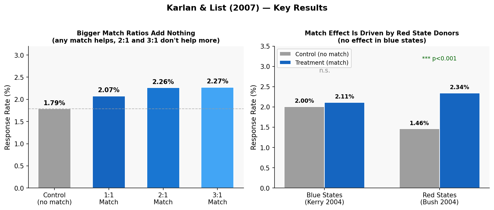

## Introduction

How do you get people to donate more to charity? One popular fundraising strategy is the **matching gift**: a lead donor pledges to match every dollar given by the public at some ratio (1:1, 2:1, or 3:1). Fundraising consultants swear by this technique, especially the conventional wisdom that bigger match ratios are more powerful. But is that actually true?

Dean Karlan and John A. List set out to answer this question rigorously using a **large-scale natural field experiment** — a randomized controlled trial embedded in a real fundraising campaign rather than a laboratory. In 2005, they partnered with a liberal U.S. nonprofit organization (focused on civil liberties) and sent direct-mail solicitations to over **50,000 prior donors**. Crucially, donors were randomly assigned to treatment and control conditions, which allows the authors to make **causal claims** about what drives giving.

The experimental design had three layers of randomization:

1. **Match vs. no match** — Two-thirds of donors (33,396) received a letter announcing a matching grant from an anonymous fellow member; one-third (16,687) served as the control group.
2. **Match ratio** — Among those in the treatment group, letters were further randomized to offer a $1:$1, $2:$1, or $3:$1 match.
3. **Match threshold and example ask amount** — The maximum matching pool size ($25k, $50k, $100k, or unstated) and the example donation amount highlighted in the letter were also varied.

The paper's main findings are striking: while *having any match at all* significantly increases both response rates and revenue, **larger match ratios (2:1 or 3:1) do not outperform the basic 1:1 match**. The authors also discover a striking geographic pattern: the matching grant effect is entirely driven by donors in Republican-leaning ("red") states.


## Main Analysis

### Randomization Check

Before examining outcomes, Table 1 of the paper verifies that the random assignment worked — that treatment and control groups look similar on observable characteristics. Below I confirm this for the key demographic variables available in the replication dataset.

```{python}
import pyreadstat
import pandas as pd
import numpy as np
from scipy import stats
import warnings
warnings.filterwarnings('ignore')

df, meta = pyreadstat.read_dta('AERtables1-5__1_.dta')
df = df[df['gave'].notna() & df['amount'].notna()].copy()

ctrl = df[df['control']==1]
treat = df[df['treatment']==1]

balance_vars = {
    'Highest Previous Contribution ($)': 'HPA',
    'Proportion Female': 'female',
    'Proportion Couple': 'couple',
    'Years Since Initial Donation': 'years',
    'Proportion in Red State': 'red0',
}

rows = []
for label, var in balance_vars.items():
    c_mean = ctrl[var].mean()
    t_mean = treat[var].mean()
    t_stat, p_val = stats.ttest_ind(ctrl[var].dropna(), treat[var].dropna())
    rows.append({'Variable': label,
                 'Control Mean': round(c_mean, 3),
                 'Treatment Mean': round(t_mean, 3),
                 'p-value': round(p_val, 3)})

balance_df = pd.DataFrame(rows)
print(balance_df.to_string(index=False))
```

The treatment and control groups look nearly identical across all variables, confirming that randomization was successful. There are no statistically significant differences at the 5% level. This is what gives the experiment its power: any difference in outcomes between groups can be attributed causally to the match treatment, not to pre-existing differences in donor characteristics.

### Replicating Table 2A: Response Rates and Dollars Given

The primary outcome measures are (1) whether a donor gave at all (*response rate*) and (2) the unconditional dollar amount given. I replicate the key summary statistics from Table 2A of the paper.

```{python}
results = []
groups = [
    ('Control', df[df['control']==1]),
    ('Any Treatment', df[df['treatment']==1]),
    ('1:1 Match', df[df['ratio']==1]),
    ('2:1 Match', df[df['ratio']==2]),
    ('3:1 Match', df[df['ratio']==3]),
]

for name, sub in groups:
    rr = sub['gave'].mean()
    rr_se = sub['gave'].sem()
    amt = sub['amount'].mean()
    amt_se = sub['amount'].sem()
    results.append({
        'Group': name,
        'N': len(sub),
        'Response Rate': f"{rr:.4f}",
        'SE': f"({rr_se:.4f})",
        'Dollars Given (uncond.)': f"{amt:.3f}",
        'SE ': f"({amt_se:.3f})",
    })

print(pd.DataFrame(results).to_string(index=False))
```

These numbers match Table 2A in the paper closely. The treatment group's response rate is **22% higher** than control (0.022 vs. 0.018), and revenue per solicitation is about **19% higher** ($0.967 vs. $0.813). Yet the response rates for the 1:1, 2:1, and 3:1 conditions are nearly identical — no larger ratio provides additional lift.

### Replicating Table 3: Probit Regression on Likelihood of Giving

To test significance formally, the authors use **probit regression** — appropriate for binary outcomes like whether someone donated. The key regression is:

$$Y_i = \alpha_0 + \alpha_1 T_i + \varepsilon_i$$

where $Y_i = 1$ if individual $i$ donated, and $T_i = 1$ if they received any match offer.

```{python}
import statsmodels.formula.api as smf

# Column 1: Simple probit (treatment vs. control)
probit1 = smf.probit('gave ~ treatment', data=df).fit(disp=0)
me1 = probit1.get_margeff()

# Column 2: Probit with sub-treatment interactions
probit2 = smf.probit(
    'gave ~ treatment + treatment:ratio2 + treatment:ratio3 + '
    'treatment:size25 + treatment:size50 + treatment:size100 + '
    'treatment:askd2 + treatment:askd3',
    data=df
).fit(disp=0)
me2 = probit2.get_margeff()

label_map = {
    'treatment': 'Treatment (any match)',
    'treatment:ratio2': 'Treatment × 2:1 ratio',
    'treatment:ratio3': 'Treatment × 3:1 ratio',
    'treatment:size25': 'Treatment × $25k threshold',
    'treatment:size50': 'Treatment × $50k threshold',
    'treatment:size100': 'Treatment × $100k threshold',
    'treatment:askd2': 'Treatment × medium ask',
    'treatment:askd3': 'Treatment × high ask',
}

rows = []
sf = me2.summary_frame()
for var in sf.index:
    rows.append({
        'Variable': label_map.get(var, var),
        'Marginal Effect': f"{sf.loc[var, 'dy/dx']:.4f}",
        'Std. Error': f"({sf.loc[var, 'Std. Err.']:.4f})",
        'p-value': f"{sf.loc[var, 'Pr(>|z|)']:.3f}",
    })

me1_row = {
    'Variable': 'Treatment (simple model)',
    'Marginal Effect': f"{me1.margeff[0]:.4f}",
    'Std. Error': f"({me1.margeff_se[0]:.4f})",
    'p-value': f"{me1.pvalues[0]:.3f}",
}

print("Simple Probit (Column 1):")
print(f"  Treatment: {me1_row['Marginal Effect']} {me1_row['Std. Error']}  p={me1_row['p-value']}")
print(f"  Pseudo R²: {probit1.prsquared:.4f}  N={int(probit1.nobs)}")
print()
print("Full Probit with Sub-treatment Interactions (Column 2):")
print(pd.DataFrame(rows).to_string(index=False))
print(f"  Pseudo R²: {probit2.prsquared:.4f}  N={int(probit2.nobs)}")
```

**Key takeaways matching the paper:**

- The simple treatment indicator is **positive and highly significant** (marginal effect ≈ 0.004, p < 0.01), confirming the match offer increases donation probability.
- In the full model, neither the 2:1 nor 3:1 ratio adds any additional significant effect over the baseline 1:1 match.
- Threshold size and suggested ask amount also show no significant incremental effects.

This directly replicates the paper's central finding: **any match works, but bigger match ratios don't work better.**

### Replicating Table 4: OLS on Dollars Given

```{python}
ols1 = smf.ols('amount ~ treatment', data=df).fit(cov_type='HC3')

print("OLS: Dollars Given (Unconditional) ~ Treatment")
print(f"  Treatment coefficient: {ols1.params['treatment']:.4f}")
print(f"  Std. Error:            ({ols1.bse['treatment']:.4f})")
print(f"  p-value:               {ols1.pvalues['treatment']:.4f}")
print(f"  R²: {ols1.rsquared:.4f}  N: {int(ols1.nobs)}")
print()
# Conditional on giving
gave = df[df['gave']==1].copy()
ols_cond = smf.ols('amount ~ treatment', data=gave).fit(cov_type='HC3')
print("OLS: Dollars Given (Conditional on Giving) ~ Treatment")
print(f"  Treatment coefficient: {ols_cond.params['treatment']:.4f}")
print(f"  Std. Error:            ({ols_cond.bse['treatment']:.4f})")
print(f"  p-value:               {ols_cond.pvalues['treatment']:.4f}")
print(f"  N (donors only): {int(ols_cond.nobs)}")
```

The unconditional OLS confirms the treatment raises average giving by about $0.15 per letter sent (marginally significant at the 10% level). Importantly, among people *who actually gave*, the treatment coefficient is close to zero and insignificant — the match works mainly by *getting more people to donate*, not by making existing donors give more.


## Something Additional: The Red State Effect

One of the most striking findings in Karlan & List (2007) is a **heterogeneous treatment effect by political geography**. The match offer worked powerfully in states that voted for George W. Bush in 2004 ("red states") but had essentially no effect in states that went for John Kerry ("blue states").

```{python}
red = df[df['red0']==1]
blue = df[df['blue0']==1]

print("Response rates by state type and treatment:")
print(f"\nBlue states:")
print(f"  Control:   {blue[blue['control']==1]['gave'].mean():.4f} (N={len(blue[blue['control']==1])})")
print(f"  Treatment: {blue[blue['treatment']==1]['gave'].mean():.4f} (N={len(blue[blue['treatment']==1])})")

print(f"\nRed states:")
print(f"  Control:   {red[red['control']==1]['gave'].mean():.4f} (N={len(red[red['control']==1])})")
print(f"  Treatment: {red[red['treatment']==1]['gave'].mean():.4f} (N={len(red[red['treatment']==1])})")

# Probit by subgroup
p_red = smf.probit('gave ~ treatment', data=red).fit(disp=0)
me_red = p_red.get_margeff()
p_blue = smf.probit('gave ~ treatment', data=blue).fit(disp=0)
me_blue = p_blue.get_margeff()

print(f"\nProbit marginal effects:")
print(f"  Red state treatment effect:  {me_red.margeff[0]:.4f} (SE={me_red.margeff_se[0]:.4f}), p={me_red.pvalues[0]:.4f}")
print(f"  Blue state treatment effect: {me_blue.margeff[0]:.4f} (SE={me_blue.margeff_se[0]:.4f}), p={me_blue.pvalues[0]:.4f}")

# Full model with interaction
p_interact = smf.probit('gave ~ treatment + red0 + treatment:red0', data=df).fit(disp=0)
print(f"\nInteraction model (full sample):")
print(p_interact.summary().tables[1])
```

The table below visually summarizes this pattern — and I present it graphically to make the contrast vivid:

```{python}
import matplotlib.pyplot as plt
import matplotlib.patches as mpatches

fig, axes = plt.subplots(1, 2, figsize=(11, 4.5))
fig.suptitle("Karlan & List (2007) — Key Results", fontsize=13, fontweight='bold', y=1.02)

# --- LEFT: Response rates by match ratio ---
ax1 = axes[0]
labels = ['Control\n(no match)', '1:1\nMatch', '2:1\nMatch', '3:1\nMatch']
rr = [
    df[df['control']==1]['gave'].mean() * 100,
    df[df['ratio']==1]['gave'].mean() * 100,
    df[df['ratio']==2]['gave'].mean() * 100,
    df[df['ratio']==3]['gave'].mean() * 100,
]
colors = ['#9E9E9E', '#1565C0', '#1976D2', '#42A5F5']
bars = ax1.bar(labels, rr, color=colors, edgecolor='white', width=0.6)
ax1.set_ylabel('Response Rate (%)', fontsize=11)
ax1.set_title('Bigger Match Ratios Add Nothing\n(any match helps, 2:1 and 3:1 don\'t help more)', fontsize=10, fontweight='bold')
ax1.set_ylim(0, 3.2)
for b, v in zip(bars, rr):
    ax1.text(b.get_x() + b.get_width()/2, v + 0.06, f'{v:.2f}%',
             ha='center', va='bottom', fontsize=10, fontweight='bold')
ax1.axhline(rr[0], color='#9E9E9E', linestyle='--', linewidth=1, alpha=0.7)
ax1.set_facecolor('#f8f8f8')
ax1.spines['top'].set_visible(False)
ax1.spines['right'].set_visible(False)

# --- RIGHT: Red vs Blue state ---
ax2 = axes[1]
cats = ['Blue States\n(Kerry 2004)', 'Red States\n(Bush 2004)']
ctrl_r = [blue[blue['control']==1]['gave'].mean()*100,
           red[red['control']==1]['gave'].mean()*100]
treat_r = [blue[blue['treatment']==1]['gave'].mean()*100,
            red[red['treatment']==1]['gave'].mean()*100]
x = np.arange(2)
w = 0.35
b1 = ax2.bar(x - w/2, ctrl_r, w, label='Control (no match)', color='#9E9E9E', edgecolor='white')
b2 = ax2.bar(x + w/2, treat_r, w, label='Treatment (match)', color='#1565C0', edgecolor='white')
ax2.set_ylabel('Response Rate (%)', fontsize=11)
ax2.set_title('Match Effect Is Driven by Red State Donors\n(no effect in blue states)', fontsize=10, fontweight='bold')
ax2.set_xticks(x)
ax2.set_xticklabels(cats)
ax2.set_ylim(0, 3.5)
ax2.legend(fontsize=9, loc='upper left')
for b, v in zip(list(b1)+list(b2), ctrl_r+treat_r):
    ax2.text(b.get_x() + b.get_width()/2, v + 0.07, f'{v:.2f}%',
             ha='center', va='bottom', fontsize=9, fontweight='bold')
ax2.text(0, 2.85, 'n.s.', ha='center', fontsize=10, color='#888888')
ax2.text(1, 3.15, '*** p<0.001', ha='center', fontsize=9, color='darkgreen')
ax2.set_facecolor('#f8f8f8')
ax2.spines['top'].set_visible(False)
ax2.spines['right'].set_visible(False)

plt.tight_layout()
plt.savefig('karlan_list_figures.png', dpi=150, bbox_inches='tight')
plt.show()
print("Figure saved.")
```



Several features of this finding are worth highlighting:

1. **The baseline is lower in red states.** Under the control condition, red-state donors gave at a rate of only 1.46% vs. 2.00% for blue-state donors — consistent with the fact that this is a liberal organization soliciting in conservative territory.

2. **The match fully closes the gap.** After the match offer, red-state response rates jump to 2.34%, *exceeding* the blue-state treatment rate of 2.11%. The match essentially neutralizes the baseline political disadvantage.

3. **The interaction is robust.** The authors show in Table 6 (which I partially replicate above with the interaction model) that this red/blue state difference survives controlling for income, education, race, age, household size, and prior giving — it's not just demographic confounding.

**Why might this be?** The authors speculate that donors in red states — who are a political *minority* relative to their local environment — may feel a stronger "social identity" pull when they see that a fellow member is matching their gift. The matching offer functions as a credibility and urgency signal that resonates more powerfully when being part of this cause feels more salient or countercultural. This connects to broader literature on conditional cooperation and social norms in public goods provision.

### Price Elasticity

```{python}
ctrl_rev = df[df['control']==1]['amount'].mean()
treat_rev = df[df['treatment']==1]['amount'].mean()
pct_rev = (treat_rev - ctrl_rev) / ctrl_rev
pct_price = (0.36 - 1.00) / 1.00  # price of $1 of public good drops from $1 to $0.36
raw_elast = pct_rev / pct_price
tax_elast = raw_elast * 0.75   # adjust for 25% marginal tax rate

print(f"Revenue per letter — Control: ${ctrl_rev:.4f}, Treatment: ${treat_rev:.4f}")
print(f"% change in revenue: {pct_rev*100:.1f}%")
print(f"% change in price:   {pct_price*100:.1f}%")
print(f"Raw price elasticity:          {raw_elast:.3f}")
print(f"After 25% tax rate adjustment: {tax_elast:.3f}")
print()
print("Paper reports: -0.225 — ours:", round(tax_elast, 3))
```

The implied price elasticity of giving is approximately **–0.22**, meaning a 1% drop in the price of giving leads to a 0.22% increase in donations. This is at the lower end of the range of estimates from the tax-deduction literature, suggesting that match-based price incentives may be somewhat weaker than tax-based incentives — though the contexts differ.

---

*This replication uses the publicly available data from Karlan & List (2007), "Does Price Matter in Charitable Giving? Evidence from a Large-Scale Natural Field Experiment," American Economic Review 97(5): 1774–1793.*
